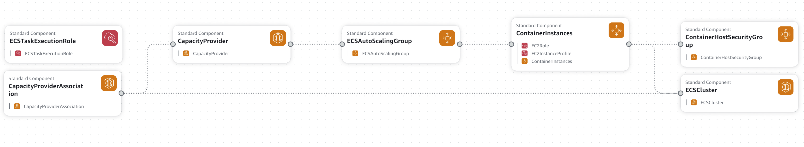

# Elastic Container Service



This template provisions the following resources:
* Task Execution Role
* Capacity Provider
* Capacity Provider Association
* Autoscaling Group
* Ec2 Role
* Ec2 Instance Profile
* Container Instances
* ECS Cluster
* Container Security Group

## Running the template
### * Validating the template
Always run validate template each time you make changes with the code.
```
aws cloudformation validate-template --template-body file://template.yaml
```

### * How to provision
Using the terminal type the following commands:
```
aws cloudformation deploy \
--template-file template.yaml \
 --stack-name  <Your-stack-name> \
--parameter-overrides file://params.json
```

### * How to delete stack

Using the terminal type the following commands:
```
 aws cloudformation delete-stack --stack-name <Your-stack-name>
```
