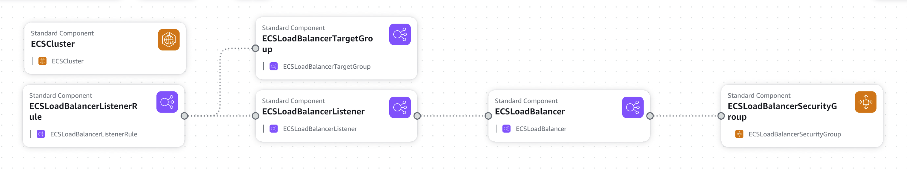

# Elastic Container Service



This template provisions the following resources:
* ECS Cluster
* Application Load Balancer
* Application Load Balancer Target Group
* Application Load Balancer Target Group Listener
* Application Load Balancer Target Group Listener Rule
* Application Load Balancer Security Group

AWS Fargate is a technology that you can use with Amazon ECS to run containers without having to manage servers or clusters of Amazon EC2 instances. With AWS Fargate, you no longer have to provision, configure, or scale clusters of virtual machines to run containers. This removes the need to choose server types, decide when to scale your clusters, or optimize cluster packing. - AWS

This Template provisions Serverless ECS cluster. It was designed to be provisioned together with an `application load balancer` and all it's necessary components to be used internally.


## Running the template
### * Validating the template
Always run validate template each time you make changes with the code.
```
aws cloudformation validate-template --template-body file://template.yaml
```

### * How to provision
Using the terminal type the following commands:
```
aws cloudformation deploy \
--template-file template.yaml \
 --stack-name  <Your-stack-name> \
--parameter-overrides file://params.json
```

### * How to delete stack

Using the terminal type the following commands:
```
 aws cloudformation delete-stack --stack-name <Your-stack-name>
```
